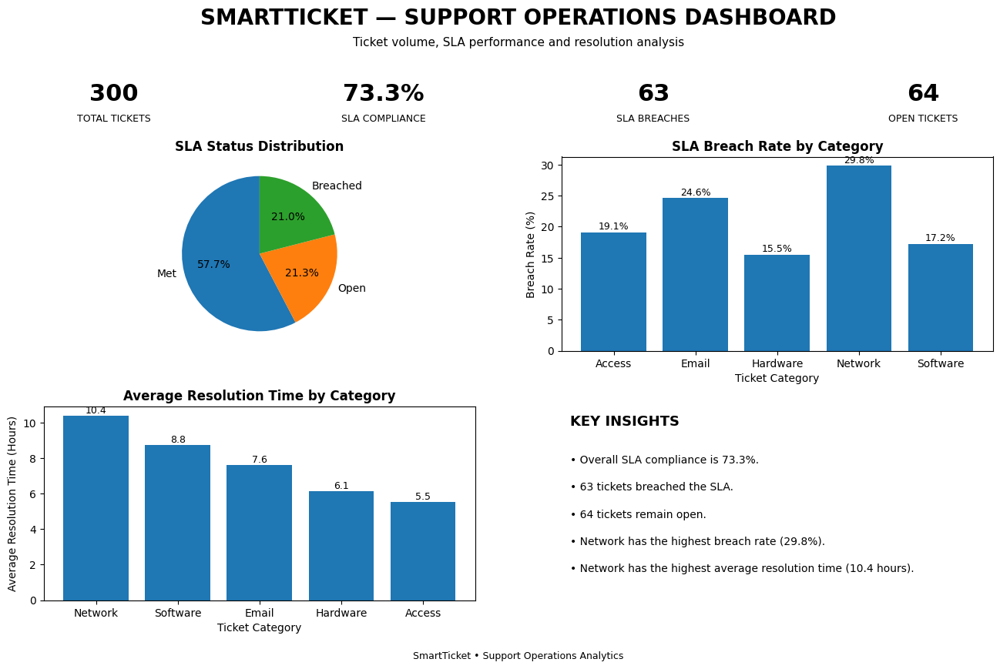

# SmartTicket — Support Operations Analytics Dashboard

## Overview

SmartTicket is a Python-based support operations analytics project that analyzes IT support ticket data to measure SLA performance, resolution time, ticket status, and category-level trends.

The project demonstrates how raw ticket data can be transformed into operational metrics and a management-ready dashboard.

## Business Problem

IT support teams handle large volumes of tickets and need to monitor:

- SLA compliance
- SLA breaches
- Open tickets
- Resolution time
- Category-level performance

SmartTicket automates the analytical workflow so these metrics can be reviewed more efficiently.

## What the Project Does

1. Loads support-ticket data from CSV
2. Converts ticket timestamps
3. Calculates ticket resolution time
4. Determines SLA status
5. Calculates overall SLA compliance
6. Identifies SLA breaches
7. Analyzes performance by ticket category
8. Generates a support operations dashboard

## Key Results

The dataset contains **300 fictional IT support tickets**.

| Metric | Result |
|---|---:|
| Total Tickets | 300 |
| SLA Compliance | 73.3% |
| SLA Breaches | 63 |
| Open Tickets | 64 |
| Highest SLA Breach Rate | Network — 29.8% |
| Highest Average Resolution Time | Network — 10.4 hours |

## Dashboard

## Key Insights

- Overall SLA compliance was **73.3%** among resolved tickets.
- **63 tickets** breached their SLA target.
- **64 tickets** remained open.
- Network tickets had the highest SLA breach rate in this dataset at **29.8%**.
- Network tickets also had the highest average resolution time at approximately **10.4 hours**.

## Technologies Used

- Python
- Pandas
- Matplotlib
- Google Colab

## Project Files

- `SmartTicket_—_Support_Operations_Analytics_Dashboard.ipynb` — Python analysis notebook
- `IMG_1665.png` — Final support operations dashboard
- `SmartTicket_Work_Sample_Final.pdf` — Recruiter-facing project summary
- `README.md` — Project documentation

## Colab Notebook

The project can also be viewed and executed through Google Colab:

https://colab.research.google.com/drive/1oZwsrtaWKVRJwTP6tIxIQDOIktQ02mZT

## Data Note

This is a self-created portfolio project using fictional IT support-ticket data. No confidential employer data was used.

## Outcome

SmartTicket demonstrates a repeatable workflow for converting ticket-level data into SLA metrics, category-level performance analysis, and a management-ready dashboard.
